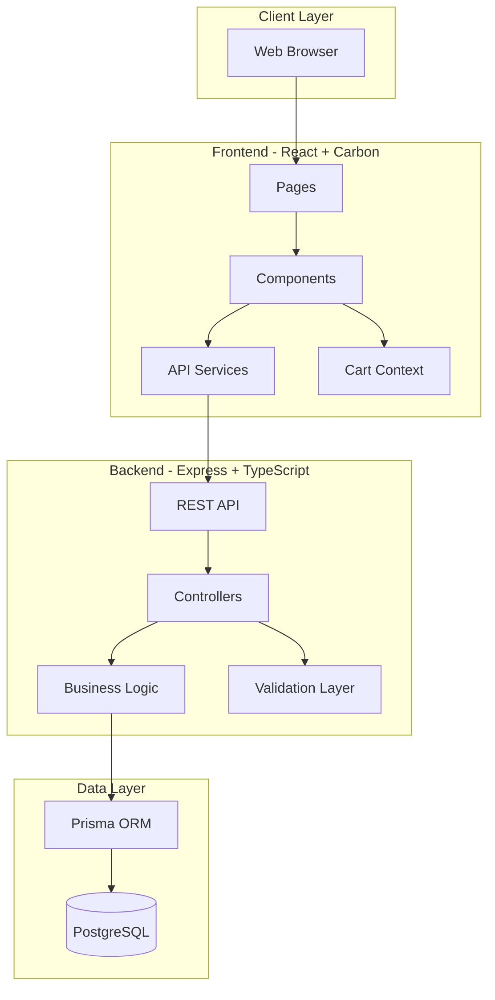
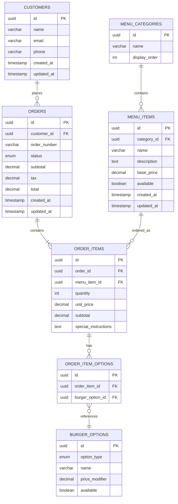
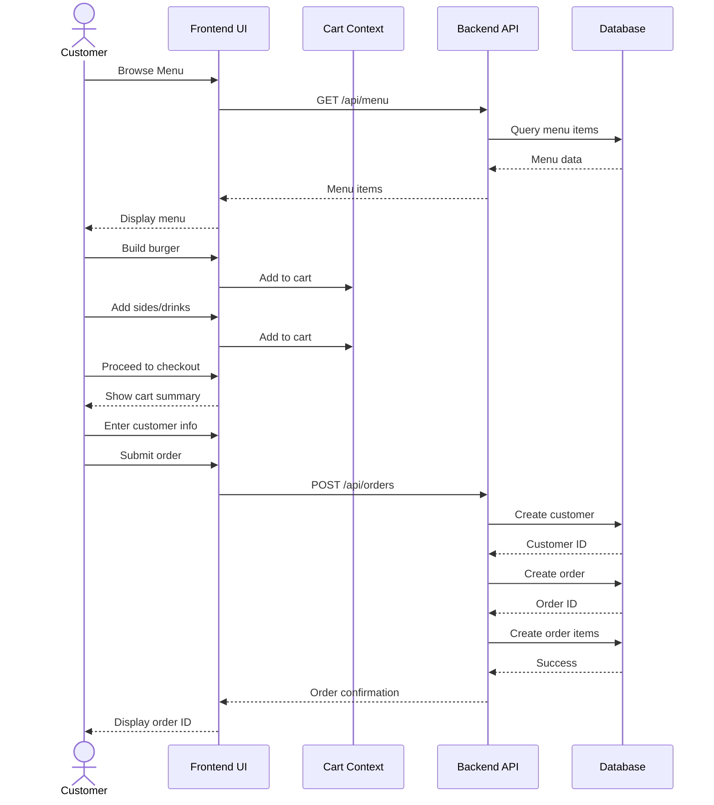
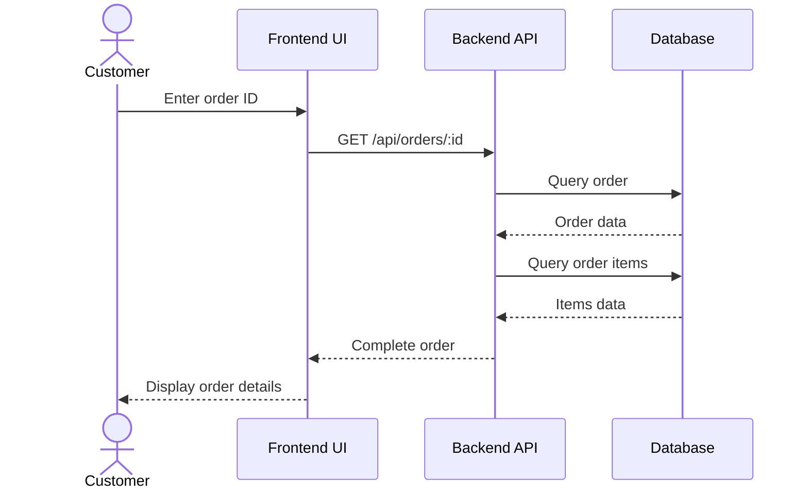
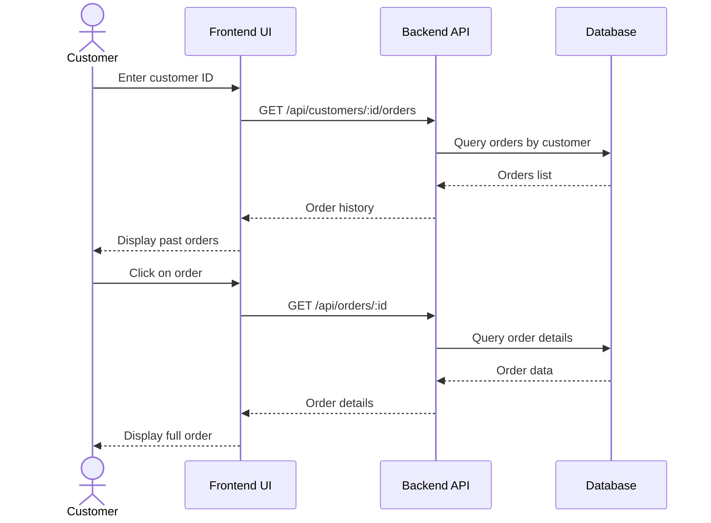
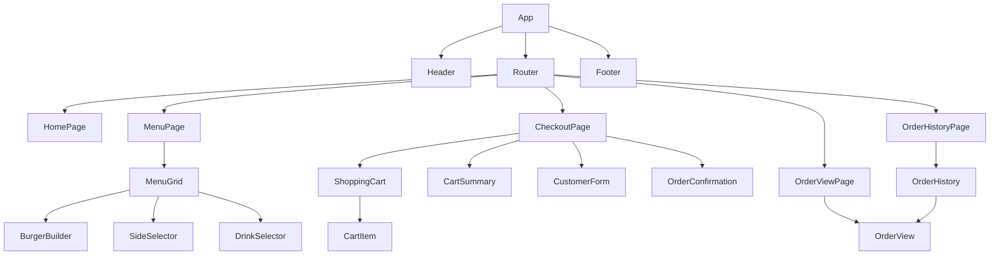
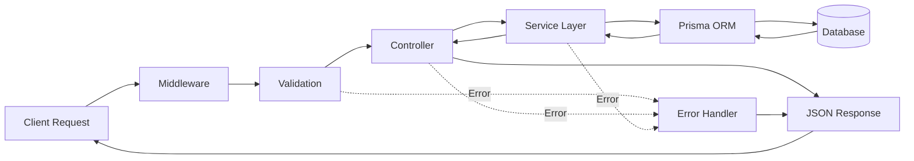
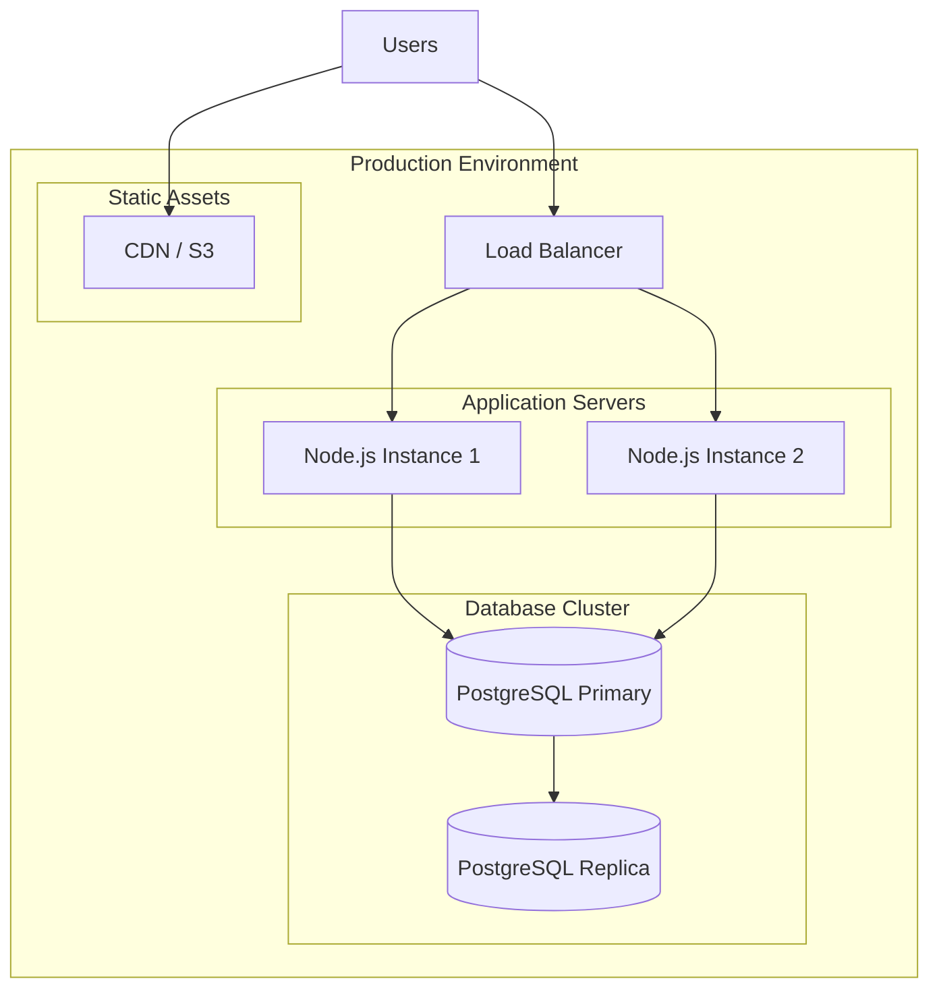
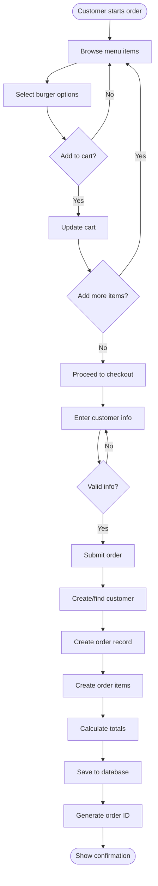

# Burger Palace - System Design

## System Architecture Diagram

## Database Entity Relationship Diagram

## User Flow - Create Order

## User Flow - View Order

## User Flow - View Order History

## Component Hierarchy

## API Request/Response Flow

## Deployment Architecture

## Data Flow - Order Creation

## Technology Stack Details

### Frontend Stack
- **React 18+**: Component-based UI framework
- **IBM Carbon Design System**: Enterprise-grade UI components
- **TypeScript**: Type-safe JavaScript
- **Vite**: Fast build tool and dev server
- **React Router**: Client-side routing
- **Axios**: HTTP client for API calls
- **Context API**: State management for cart

### Backend Stack
- **Node.js**: JavaScript runtime
- **Express.js**: Web application framework
- **TypeScript**: Type-safe development
- **Prisma**: Modern ORM with type safety
- **Zod**: Schema validation
- **Winston**: Logging
- **Helmet**: Security middleware
- **CORS**: Cross-origin resource sharing

### Database
- **PostgreSQL 14+**: Relational database
- **Prisma Migrate**: Database migrations
- **UUID**: Primary key generation

### Development Tools
- **ESLint**: Code linting
- **Prettier**: Code formatting
- **Jest**: Unit testing
- **Supertest**: API testing
- **Docker**: Containerization
- **Docker Compose**: Multi-container orchestration

## Security Considerations

1. **Input Validation**: All user inputs validated with Zod schemas
2. **SQL Injection Prevention**: Prisma ORM parameterized queries
3. **CORS Configuration**: Restricted to frontend domain
4. **Rate Limiting**: Prevent API abuse
5. **Error Handling**: No sensitive data in error messages
6. **Environment Variables**: Sensitive config in .env files
7. **HTTPS**: SSL/TLS in production
8. **Helmet.js**: Security headers

## Performance Optimization

1. **Database Indexing**: Indexes on frequently queried fields
2. **Connection Pooling**: Efficient database connections
3. **Caching**: Redis for menu items (future enhancement)
4. **Code Splitting**: Lazy loading React components
5. **Image Optimization**: Compressed images for menu items
6. **CDN**: Static assets served from CDN
7. **Pagination**: Large result sets paginated
8. **Database Queries**: Optimized with proper joins and selects

## Monitoring and Logging

1. **Application Logs**: Winston for structured logging
2. **Error Tracking**: Log errors with stack traces
3. **API Metrics**: Response times and error rates
4. **Database Monitoring**: Query performance
5. **Health Checks**: Endpoint for service health